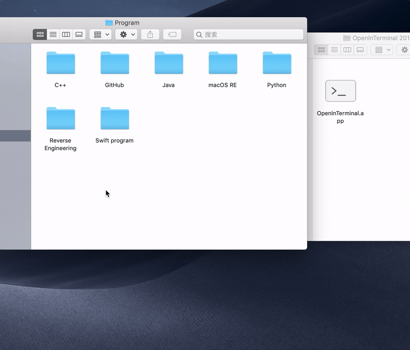

 # OpenInTerminal

一个可以在终端（iTerm 或 Hyper）中打开当前目录的访达工具栏应用程序。

## 如何使用

### 1) 在终端中打开当前目录

### 2) 在终端中打开选择的文件夹

### 3) 其他

如果既没有打开访达窗口，也没有选中文件夹，那么程序将会在 `Terminal` 或者 `iTerm` 里打开 `Home` 目录。

## 如何安装

1. 从 [release](https://github.com/Ji4n1ng/OpenInTerminal/releases) 中下载。
2. 将应用移动到 `应用程序` 文件夹.
3. 右键点击`访达`工具栏，选择`自定义工具栏`。将应用拖到工具栏中。
4. 完成。

>  ⚠️ 当您第一次运行应用程序时，macOS 将要求访问 `访达` 和 `终端`（或 `iTerm`）的权限。请给予应用程序权限。

### 如果你正在使用深色模式 (Dark Mode)

我在 release 中提供了几个图标。 您可以右键单击该应用程序并选择 `显示简介`。 拖动图标进行更改。

