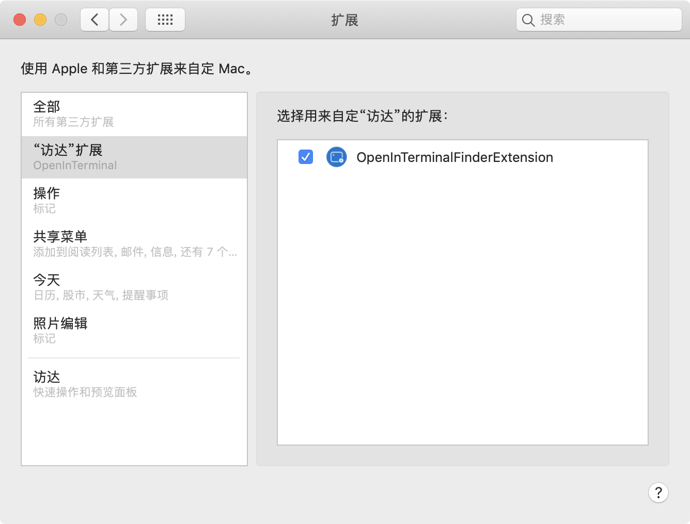
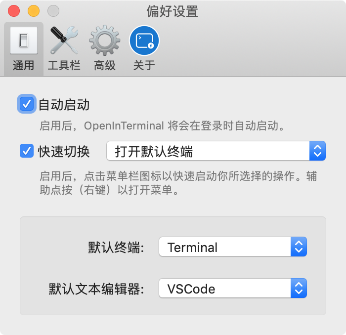

    
  
  
  
  

[English](./README.md) | 中文说明

## 如何使用 🚀

### 1) 在终端（或编辑器）中打开当前目录

### 2) 在终端（或编辑器）中打开选择的文件夹或文件

### 3）将已选择的文件或者访达窗口的路径拷贝到粘贴板

### 更多功能

- ✅ 支持 Terminal, [iTerm](https://www.iterm2.com/), [Hyper](https://github.com/zeit/hyper) 和 [Alacritty](https://github.com/jwilm/alacritty).
- ✅ 支持 [Visual Studio Code](https://code.visualstudio.com/),  [Atom](https://atom.io/) 和 [Sublime Text](https://www.sublimetext.com/).
- ✅ 设置为打开新的窗口或者标签页
- ✅ 从菜单栏快速启动指定动作
- ✅ 支持 Dark Mode

### 我仍然想用 OpenInTerminal-Lite

请看文档： [English](./README-Lite.md) | [中文说明](README-Lite-zh.md)

## 如何安装 🖥

### 1. 下载

#### a) Homebrew (即将支持)

#### b) 手动 (最新版本：0.9.0)

1. 从 [release](https://github.com/Ji4n1ng/OpenInTerminal/releases) 中下载。
2. 将应用移动到 `应用程序` 文件夹。
3. 完成。

> ⚠️ 当您第一次运行应用程序时，macOS 将要求访问 `访达` 和 `终端`（或 `iTerm`）的权限。请给予应用程序权限。

### 2. 打开 Finder 扩展权限

去 `系统偏好设置` -> `扩展` -> `访达扩展`，打开下图中的权限按钮。

### 3. 将 OpenInTerminal 设置为开机启动

勾选 `偏好设置` 中的 `自动启动` 按钮即可。

> 如果 OpenInTerminal 主应用不运行， Finder 扩展将不会工作。所以更推荐将 OpenInTerminal 设置为自动启动。

## 常见问题 ❓

1. Finder 扩展不工作了
 

请检查 OpenInTerminal（主应用）的图标是否在菜单栏中。因为 Finder 扩展会一直在 Finder 工具栏中，所以当主应用不运行时 Finder 扩展无法工作。推荐在偏好设置中将 OpenInTerminal 设置为自动启动。

2. 我不小心点了不授权的按钮
 

你可以运行以下命令。这会重置系统设置里的权限。

<pre><code>tccutil reset AppleEvents</code></pre>

3. 路径里的特殊字符
 

请不要在路径中使用反斜线 <code>\</code> 和双引号 <code>"</code>。

## 版本变动 🗒

**version 0.9.0**

OpenInTerminal 经过几周的开发现在已经发行了。如果你有任何建议或者有 BUG，欢迎新建一个 issue。

旧版本
 

<strong>version 0.4.1</strong>

<ul>
<li>支持 <code>Alacritty</code></li>
</ul>

<strong>version 0.4.0</strong>

<ul>
<li>当使用 Terminal 和 iTerm 的时候，你可以设置默认打开新的标签页或者窗口。</li>
</ul>

<strong>version 0.3.0</strong>

<ul>
<li>更名为 OpenInTerminal-Lite (OpenInTerminal 将会在未来以功能更强大的版本出现)</li>
<li>解决了当打开 Hyper 的时候，特殊字符导致程序崩溃的 bug</li>
</ul>

<strong>version 0.2.0</strong>

<ul>
<li>增加终端选择框</li>
<li>在打开 iTerm 的时候，取消执行 <code>clear</code> 命令</li>
</ul>

<strong>version 0.1.1</strong>

<ul>
<li>支持 <code>Hyper</code></li>
<li>在打开 iTerm 的时候，优先新建一个 tab 标签页。</li>
</ul>

<strong>version 0.1.0</strong>

<ul>
<li>第一次 release</li>
</ul>
 

## 特别感谢 ❤️

### 贡献者

- [Camji55](https://github.com/Camji55)

### 参考项目

- [jbtule/cdto](https://github.com/jbtule/cdto)
- [es-kumagai/OpenTerminal](https://github.com/es-kumagai/OpenTerminal)
- [tingraldi/SwiftScripting](https://github.com/tingraldi/SwiftScripting)