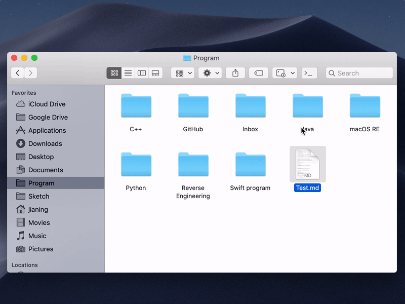
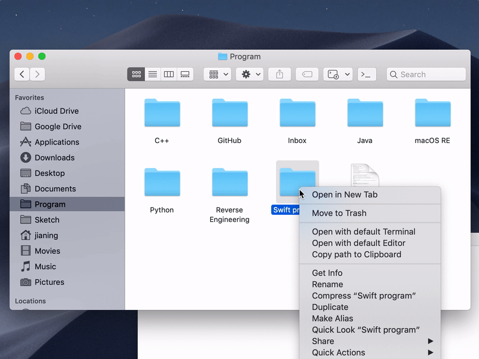
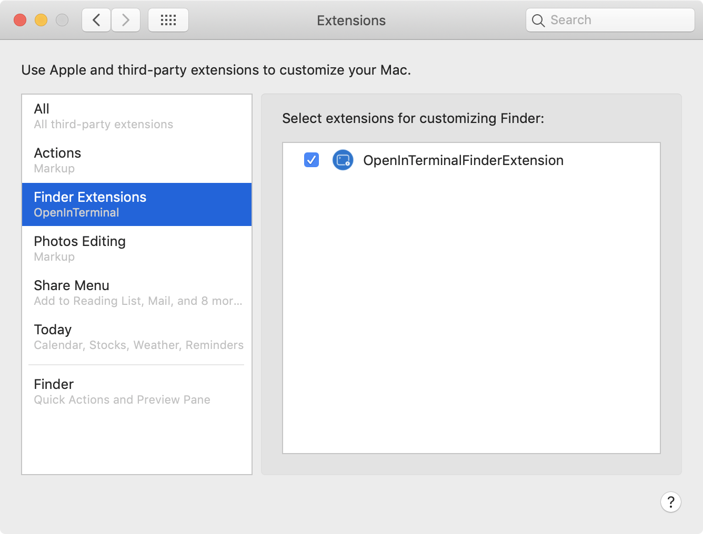

<p align="center">
  <br/><br/>
  <a href="https://github.com/Ji4n1ng/OpenInTerminal/releases/tag/0.9.0"></a>
  <a href="https://github.com/Ji4n1ng/OpenInTerminal/blob/master/LICENSE"></a>
  
  <a href="https://travis-ci.org/Ji4n1ng/OpenInTerminal"></a>
</p>

English | [中文说明](./README-zh.md)

## How to use 🚀

### 1) Open current directory in Terminal (or Editor)

<div>
  
</div>

### 2) Open selected folder or file in Terminal (or Editor)

<div>
  
</div>

### 3) Copy path of the selected file or Finder window to Clipboard

<div>
  
</div>

### More features

- ✅ Support Terminal, [iTerm](https://www.iterm2.com/), [Hyper](https://github.com/zeit/hyper) and [Alacritty](https://github.com/jwilm/alacritty).
- ✅ Support [Visual Studio Code](https://code.visualstudio.com/),  [Atom](https://atom.io/) and [Sublime Text](https://www.sublimetext.com/).
- ✅ Set to open a new tab or window.
- ✅ Quick toggle the specified action from Menu bar.
- ✅ Support Dark Mode.
- ✅ Support English, Chinese and French.

## OpenInTerminal and OpenInTerminal-Lite 👀

There are a normal version and a lite version of OpenInTerminal. If you only need to open the terminal and don't need to keep the application in the background, then you can use `OpenInTerminal-Lite`. If you like more powerful features, then you can use `OpenInTerminal`.

For `OpenInTerminal-Lite` users:

Please check the document: [English](./README-Lite.md) | [中文说明](README-Lite-zh.md)

## How to install 🖥

### 1. Download

#### a) Homebrew (latest version: 0.9.0)

1. Run the following command.

   ```
   brew cask install openinterminal
   ```

2. Done.

#### b) Manual (latest version: 0.9.0)

1. Download from [release](https://github.com/Ji4n1ng/OpenInTerminal/releases).

2. Move the app into `/Applications`.

3. Done.

> ⚠️ macOS will ask your permissions to access Finder and other applications when you run the app for the first time. Please give OpenInTerminal the permissions.

### 2. Check Finder Extension permission

Open the OpenInTerminal app. Go to `System Preferences` -> `Extensions` -> `Finder Extensions`, check the permission button as below.

<div>
  
</div>

### 3. Set OpenInTerminal to launch at login

Just check the `Launch OpenInTerminal at login` button in `Preferences`.

> Because the Finder Extension does not work when the main app is not running, it is very recommended to set OpenInTerminal to launch at login.

<div>
  
</div>

## Todo 👨‍💻

- Supporting keyboard shortcuts


If you have a good idea, feel welcome to open a new [issue](https://github.com/Ji4n1ng/OpenInTerminal/issues/new/choose).

## FAQ ❓

<details><summary>1. What is the difference between OpenInTerminal and OpenInTerminal-Lite?</summary><br>
<p>OpenInTerminal currently has a normal version and a lite version. If you only need to open the terminal and don't need to keep the application in the background, then you can use the Lite version. If you like more powerful features, then choose the normal version. </p>
</details>

<details><summary>2. Finder Extension doesn't work</summary><br>
<p>Please check if there is an OpenInTerminal(main app) icon in the status bar. The Finder Extension will always be in the toolbar. But if the main app is not open, it will not work. It is recommended to set OpenInTerminal to launch at login in Preferences.</p>
</details>

<details><summary>3. I accidentally clicked on the <code>Don't Allow</code>  button.</summary><br>
<p>You can run the following command in the terminal. This will reset the permissions in the System Preferences.</p>
<br><code>tccutil reset AppleEvents</code><br>
</details>

<details><summary>4. Special characters in the <code>path</code>.</summary><br>
<p>Please do not use backslash <code>\</code> and double quotes <code>"</code> in the path.</p>
</details>

## Changes 🗒

**version 0.9.1**

Support French.

<details><summary>old version</summary><br>
<p><strong>version 0.9.0</strong></p>
<ul>
<li>OpenInTerminal has been released after several weeks of development. If you have suggestions or there are bugs, please feel free to open an issue.</li>
</ul>
<p><strong>version 0.4.1</strong></p>
<ul>
<li>Support <code>Alacritty</code></li>
</ul>
<p><strong>version 0.4.0</strong></p>
<ul>
<li>You can set a default to open a new tab or window when using <code>Terminal</code> and <code>Hyper</code>.</li>
</ul>
<p><strong>version 0.3.0</strong></p>
<ul>
<li>Change name to <code>OpenInTerminal-Lite</code> (<code>OpenInTerminal</code> will come as a more powerful version in the future.)</li>
<li>Fix a bug that some special characters in the path would crash the program when opening Hyper.</li>
</ul>
<p><strong>version 0.2.0</strong></p>
<ul>
<li>Add terminal selector</li>
<li>Cancel running <code>clear</code> command when opening iTerm</li>
</ul>
<p><strong>version 0.1.1</strong></p>
<ul>
<li>Support <code>Hyper</code></li>
<li>Give priority to creating a new tab when opening iTerm</li>
</ul>
<p><strong>version 0.1.0</strong></p>
<ul>
<li>First release</li>
</ul>
<br>
</details>

## Special Thanks to ❤️

### Contributors

- [Camji55](https://github.com/Camji55)

### Translators

- [Dorian Eydoux](https://github.com/dorianeydx)

### Reference projects

- [jbtule/cdto](https://github.com/jbtule/cdto)
- [es-kumagai/OpenTerminal](https://github.com/es-kumagai/OpenTerminal)
- [tingraldi/SwiftScripting](https://github.com/tingraldi/SwiftScripting)
