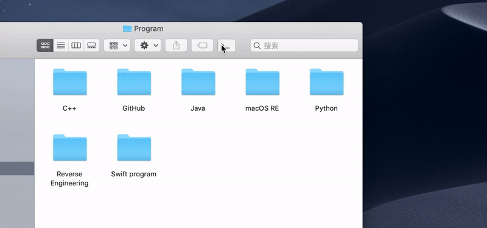
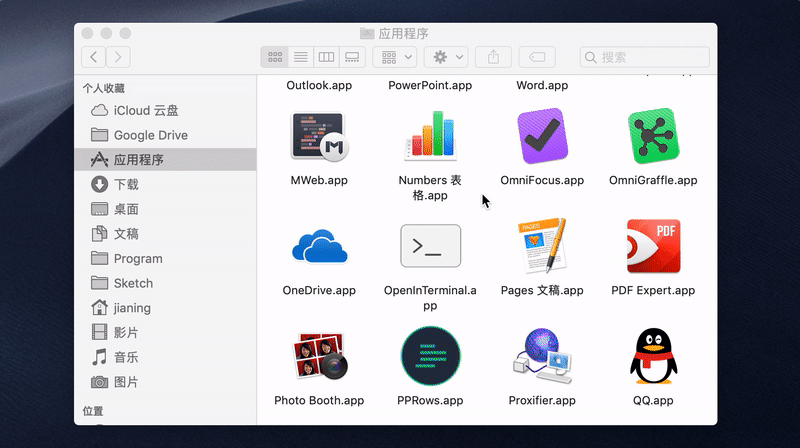
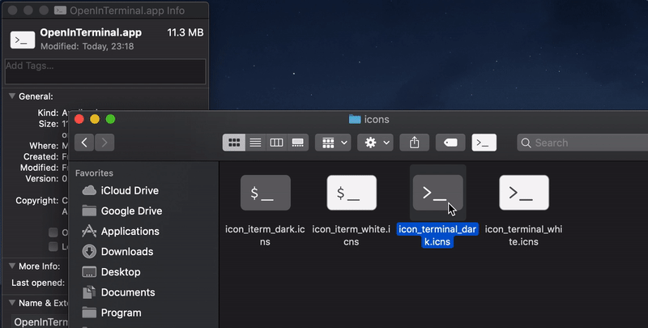

# OpenInTerminal

✨ Finder Toolbar app for macOS to open the current directory in `Terminal`, [`iTerm`](https://www.iterm2.com/) or [`Hyper`](https://github.com/zeit/hyper). 

[中文说明](./README-zh.md)

## How to use 🚀

### 1) Open current directory from toolbar



### 2) Open selected folder or file from Toolbar


### 3) Set default terminal

You are asked to set the default terminal to open after first launch.


The selection box will not appear after you have set the default terminal. If you want to reset the default terminal, please enter the following command in the terminal. Then just run the application again.

```
defaults remove wang.jianing.OpenInTerminal OIT_TerminalBundleIdentifier
```

## How to install 🖥

### Homebrew

1. Run the following command

   ```
   brew cask install openinterminal
   ```

2. In `/Applications` folder, hold down the `Cmd` key and drag the app into Finder Toolbar.

3. Done



###Manual

1. Download from [release](https://github.com/Ji4n1ng/OpenInTerminal/releases).
2. Move the app into `/Applications`.
3. Hold down the `Cmd` key and drag the app into Finder Toolbar.
4. Done.

>  ⚠️ macOS will ask your permissions to access Finder and Terminal (iTerm or Hyper) when you run the app for the first time. Please give the application permissions.

### If you are using Dark Mode

I provided several icons along with the app in the [release](https://github.com/Ji4n1ng/OpenInTerminal/releases). You can right click on the app and select `Get Info`. Drag the icon to cover the default icon.



## How to build 🔨

`Mojave build passing ✅`

```
git clone https://github.com/Ji4n1ng/OpenInTerminal
cd OpenInTerminal
xcodebuild
```

## Todo 👨‍💻

- ~~Dynamically change icon depending on Dark Mode.~~

If you have a good idea, welcome to open a new `issue` .

## Changes 🗒

**version 0.2.0**

- Add terminal selector
- Cancel running `clear` command when opening iTerm

**version 0.1.1**

- Support `Hyper`
- Give priority to creating a new tab when opening iTerm

**version 0.1.0**

- First release

## Special Thanks to ❤️

### Contributors

- [Camji55](https://github.com/Camji55)

### Reference projects

- [jbtule/cdto](https://github.com/jbtule/cdto)
- [es-kumagai/OpenTerminal](https://github.com/es-kumagai/OpenTerminal)
- [tingraldi/SwiftScripting](https://github.com/tingraldi/SwiftScripting)