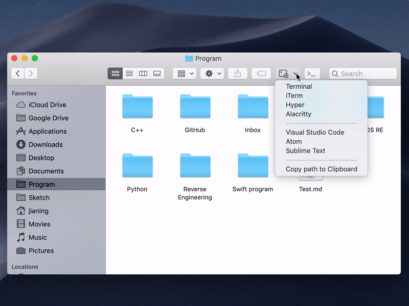

<p align="center">
  <br/><br/>
  <a href="https://github.com/Ji4n1ng/OpenInTerminal/releases/tag/2.1.1"></a>
  <a href="https://github.com/Ji4n1ng/OpenInTerminal/blob/master/LICENSE"></a>
  
  <a href="https://travis-ci.org/Ji4n1ng/OpenInTerminal"></a>
</p>

English | [OpenInTerminal 中文说明](./Resources/README-zh.md)

[OpenInTerminal-Lite English](./Resources/README-Lite.md) | [OpenInTerminal-Lite 中文说明](./Resources/README-Lite-zh.md)

## How to use 🚀

| Features | OpenInTerminal | OpenInTerminal-Lite & OpenInEditor-Lite |
| --- | --- | --- |
| Open current directory in Terminal (or Editor) |  |  |
| Open selected folder or file in Terminal (or Editor) |  |  |
| Copy path of the selected file or Finder window to Clipboard |  |  ❌ Not Supported |

### More features

| Features | OpenInTerminal | OpenInTerminal-Lite & OpenInEditor-Lite |
| --- | --- | --- |
| Support Terminal, [iTerm](https://www.iterm2.com/), [Hyper](https://github.com/zeit/hyper) and [Alacritty](https://github.com/jwilm/alacritty). | ✅ | ✅ |
| Support [Visual Studio Code](https://code.visualstudio.com/), [VSCode Insiders](https://code.visualstudio.com/insiders/), [Atom](https://atom.io/), [Sublime Text](https://www.sublimetext.com/), [VSCodium](https://github.com/VSCodium/vscodium), [BBEdit](https://www.barebones.com/products/bbedit/), [TextMate](https://macromates.com), [CotEditor](https://coteditor.com/) and [MacVim](https://github.com/macvim-dev/macvim). | ✅ | ✅ |
| Set to open a new tab or window. | ✅ | ✅ |
| Support English, Chinese and French. | ✅ | ✅ |
| GUI preferences | ✅ | ❌ |
| Support keyboard shortcuts. | ✅ | ❌ |
| Support Dark Mode. | ✅ | ❌ |
| No need to run in the background | ❌ | ✅ |

## OpenInTerminal and OpenInTerminal-Lite (OpenInEditor-Lite) 👀

Which one to choose? Both of these apps are my children. If you like more powerful features and GUI preferences, then you can use `OpenInTerminal`. If you just need to open terminal faster and more stably, then you can use `OpenInTerminal-Lite`.

For me, I prefer `OpenInTerminal-Lite` which only needs to click once to complete the function (and the other needs to click twice 😂) and it is more lightweight.

For `OpenInTerminal-Lite` users:

Please check the document: [OpenInTerminal-Lite English](./Resources/README-Lite.md) | [OpenInTerminal-Lite 中文说明](./Resources/README-Lite-zh.md)

## How to install 🖥

### 1. Download

#### a) Homebrew (current version: 2.1.1)

```
brew cask install openinterminal
```

#### b) Manual (latest version: 2.1.1)

1. Download from [release](https://github.com/Ji4n1ng/OpenInTerminal/releases).

2. Move the app into `/Applications`.

> ⚠️ macOS will ask your permissions to access Finder and other applications when you run the app for the first time. Please give OpenInTerminal the permissions.

### 2. Check Finder Extension permission

Open the OpenInTerminal app. Go to `System Preferences` -> `Extensions` -> `Finder Extensions`, check the permission button as below.

<div>
  
</div>

## Todo 👨‍💻

If you have a good idea, feel welcome to open a new [issue](https://github.com/Ji4n1ng/OpenInTerminal/issues/new/choose).

- Open iTerm in split pane
- Custom 'Open in Application'
- Fix: open multiple selected files in editor
- Custom Context Menu

## Support ❤️

Hello, I am Ji4n1ng. I am a student and OpenInTerminal is an open source project I maintain in my spare time. It is free and open source. I will be very grateful that you can support me in purchasing an Apple Developer account. $99/year is not a small expense for students. It's close to my three-week living expenses. Thanks a lot!

| PayPal | AliPay | WeChat Pay |
| --- | --- | --- |
| [paypal.me/ji4n1ng](https://www.paypal.me/ji4n1ng) |  |  |

## FAQ ❓

<details><summary>1. What is the difference between OpenInTerminal and OpenInTerminal-Lite?</summary><br>
<p>OpenInTerminal currently has a normal version and a lite version. If you like more powerful features and GUI preferences, then you can use OpenInTerminal. If you just need to open terminal faster and more stably, then you can use OpenInTerminal-Lite.</p>
</details>

<details><summary>2. I accidentally clicked on the <code>Don't Allow</code>  button.</summary><br>
<p>You can run the following command in the terminal. This will reset the permissions in the System Preferences.</p>
<br><code>tccutil reset AppleEvents</code><br>
</details>

<details><summary>3. Special characters in the <code>path</code>.</summary><br>
<p>Please do not use backslash <code>\</code> and double quotes <code>"</code> in the path.</p>
</details>

<details><summary>4. Open two Terminal windows on Mojave</summary><br>
<p>This problem usually occurs when Terminal is first started. So you can use <code>⌘W</code> to close Terminal window instead of using <code>⌘Q</code> to quit Terminal.</p>
</details>

<details><summary>5. Finder Extension Standalone Operation Mode</summary><br>
<p>Currently Finder extension is completely dependent on AppleScript in order to run independently. So it is hard to guarantee its stability. When you find that Finder extension doesn't work properly, you need to hold down the <code>Option(⌥)</code> key, right-click on Finder, and select <code>Relaunch</code>.</p>
</details>

<details><summary>6. OpenInTerminal doesn't work as I expected</summary><br>
<p>OpenInTerminal will open terminal or editor as the following order:</p>
<ul>
<li>1. Open the file or folder that you selected.</li>
<li>2. Open the top Finder window.</li>
<li>3. Neither. Then open the desktop.</li>
</ul>
<p>For example, if you select a file in the bottom Finder window and you want to open the above Finder window in terminal, this will not work as you expected according to the above order.</p>
<p>Q: I right-click on the desktop but no terminal or editor appears. But actions in status bar menu work.</p>
<p>A: Try to select a file(folder) or open a Finder window. Because when you right-click on the desktop and nothing is selected, system does not provide program with the path of selected files. Under this situation, the program does not work.<br>Currently they(Fidner extension and actions in status bar menu) do not work as the same way. Finder extension is completely dependent on AppleScript in order to run independently, while status bar icon works as before. So they have different behaviors. This problem will be improved in the future.</p>
</details>

## Changes 🗒

**version 2.1.1**

- Signed the application with the developer account. Bundle ID has changed.
- Support Finder Extension Standalone Operation Mode.
- Support CotEditor and MacVim.
- User can hide context menu items.
- Finder context menu item's title will change to the current default terminal / editor.

**version 2.0.5**

- Fix: check application exist bug

<details><summary>old version</summary><br>
<p><strong>version 2.0.4</strong></p>
<ul>
<li>Support TextMate</li>
<li>Fix: keyboard shortcut bug</li>
</ul>
<p><strong>version 2.0.3</strong></p>
<ul>
<li>Fix: Finder context menu icon supports dark mode</li>
</ul>
<p><strong>version 2.0.2</strong></p>
<ul>
<li>Support Visual Studio Code - Insiders</li>
<li>Support for hiding the status bar icon</li>
</ul>
<p><strong>version 2.0.1</strong></p>
<ul>
<li>Support BBEdit</li>
<li>Add icon in Finder context menu</li>
<li>Fix: check application folder under home directory</li>
</ul>
<p><strong>version 0.10.2</strong></p>
<ul>
<li>Fix: Finder context menu does not appear on other disks.</li>
</ul>
<p><strong>version 0.10.1</strong></p>
<ul>
<li>iTerm will not leave `cd xxx` in history.</li>
<li>You need to click the `window` button or the `tab` button of iTerm again in `Preferences`.</li>
</ul>
<p><strong>version 0.10.0</strong></p>
<ul>
<li>Support keyboard shortcuts.</li>
<li>Support VSCodium.</li>
</ul>
<p><strong>version 0.9.1</strong></p>
<ul>
<li>Support French.</li>
</ul>
<p><strong>version 0.9.0</strong></p>
<ul>
<li>OpenInTerminal has been released after several weeks of development. If you have suggestions or there are bugs, please feel free to open an issue.</li>
</ul>
<p><strong>version 0.4.1</strong></p>
<ul>
<li>Support <code>Alacritty</code></li>
</ul>
<p><strong>version 0.4.0</strong></p>
<ul>
<li>You can set a default to open a new tab or window when using <code>Terminal</code> and <code>Hyper</code>.</li>
</ul>
<p><strong>version 0.3.0</strong></p>
<ul>
<li>Change name to <code>OpenInTerminal-Lite</code> (<code>OpenInTerminal</code> will come as a more powerful version in the future.)</li>
<li>Fix a bug that some special characters in the path would crash the program when opening Hyper.</li>
</ul>
<p><strong>version 0.2.0</strong></p>
<ul>
<li>Add terminal selector</li>
<li>Cancel running <code>clear</code> command when opening iTerm</li>
</ul>
<p><strong>version 0.1.1</strong></p>
<ul>
<li>Support <code>Hyper</code></li>
<li>Give priority to creating a new tab when opening iTerm</li>
</ul>
<p><strong>version 0.1.0</strong></p>
<ul>
<li>First release</li>
</ul>
<br>
</details>

## Special Thanks to ❤️

### Contributors

- [Camji55](https://github.com/Camji55)

### Translators

- [Dorian Eydoux](https://github.com/dorian-eydoux)

### Reference projects

- [jbtule/cdto](https://github.com/jbtule/cdto)
- [es-kumagai/OpenTerminal](https://github.com/es-kumagai/OpenTerminal)
- [tingraldi/SwiftScripting](https://github.com/tingraldi/SwiftScripting)
