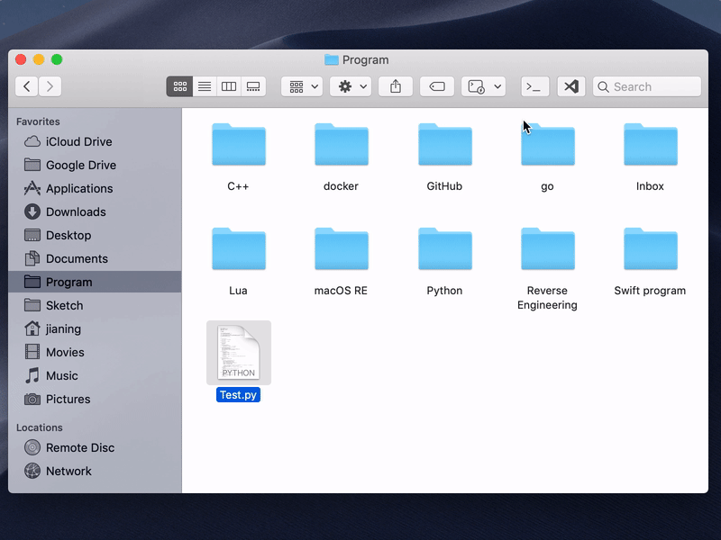
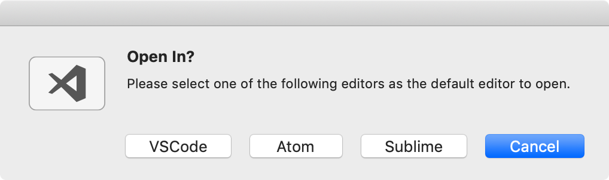
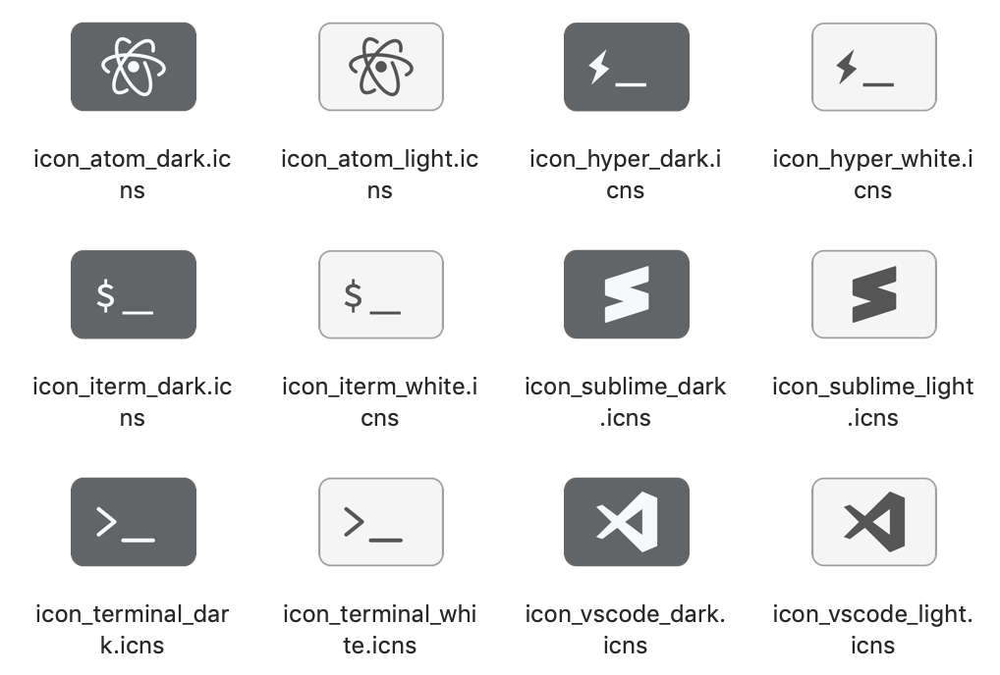
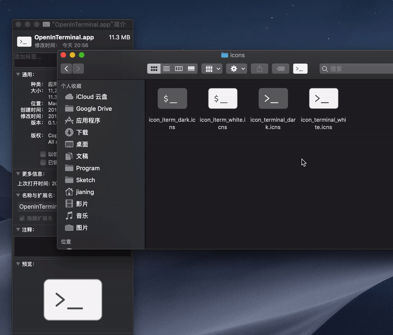

<p align="center">
  <br/><br/>
  <a href="https://github.com/Ji4n1ng/OpenInTerminal/releases/tag/1.1.0"></a>
  <a href="https://github.com/Ji4n1ng/OpenInTerminal/blob/master/LICENSE"></a>
  
  <a href="https://travis-ci.org/Ji4n1ng/OpenInTerminal"></a>
</p>

[English](./README-Lite.md) | 中文说明

## 如何使用 🚀

### 1) 在终端（或编辑器）中打开当前目录

<div>
  
</div>

### 2) 在终端（或编辑器）中打开选择的文件夹或文件

<div>
  
</div>

## 如何安装 🖥

### Homebrew (当前版本：1.1.0)

1. 运行以下命令

```
brew cask install openinterminal-lite
# 或者
brew cask install openineditor-lite
```

2. 在 `应用程序` 文件夹中，按住 `Cmd` 键，然后将应用拖到访达工具栏中。

>  ⚠️ 当您第一次运行应用程序时，macOS 将要求访问 `访达` 和 `终端`（或 `iTerm`）的权限。请给予应用程序权限。

<div>
  
</div>

### 手动安装 (最新版本：1.1.0)

1. 从 [release](https://github.com/Ji4n1ng/OpenInTerminal/releases) 中下载。
2. 将应用移动到 `应用程序` 文件夹。
3. 按住 `Cmd` 键，然后将应用拖到访达工具栏中。

## 支持 ❤️

你好，我是 Ji4n1ng。我是一名学生，OpenInTerminal 是我空余时间维护的一个开源项目。它是免费且开源的。如果你能支持我购买苹果开发者账号，我将非常感激。一年 99 美元的花费对于学生来说，并不是一个小的数字，它几乎是我三个星期的生活费。非常感谢！

| PayPal | 支付宝 | 微信 |
| --- | --- | --- |
| [paypal.me/ji4n1ng](https://www.paypal.me/ji4n1ng) |  |  |

## 设置 🔨 

### 1) 设置默认终端（或编辑器）

在第一次运行应用的时候，你需要选择默认终端。

<div>
  
  
</div>

当你设置了默认终端之后，选择框将不会再出现。如果你想要重新设置默认终端，请在终端中输入以下命令。然后重新运行应用。

```
# 对于 OpenInTerminal-Lite:
defaults remove wang.jianing.app.OpenInTerminal-Lite OIT_TerminalBundleIdentifier
# 对于 OpenInEditor-Lite:
defaults remove wang.jianing.app.OpenInEditor-Lite OIT_EditorBundleIdentifier
```

<details><summary>设置 <strong>Alacritty</strong> 为默认终端:</summary><br>
<code>defaults write wang.jianing.app.OpenInTerminal-Lite OIT_TerminalBundleIdentifier Alacritty</code>
<br>
</details>

<details><summary>设置 <strong>VSCodium</strong> 为默认编辑器:</summary><br>
<code>defaults write wang.jianing.app.OpenInEditor-Lite OIT_EditorBundleIdentifier VSCodium</code>
<br>
</details>

<details><summary>设置 <strong>BBEdit</strong> 为默认编辑器:</summary><br>
<code>defaults write wang.jianing.app.OpenInEditor-Lite OIT_EditorBundleIdentifier BBEdit</code>
<br>
</details>

<details><summary>设置 <strong>Visual Studio Code - Insiders</strong> 为默认编辑器:</summary><br>
<code>defaults write wang.jianing.app.OpenInEditor-Lite OIT_EditorBundleIdentifier VSCodeInsiders</code>
<br>
</details>

<details><summary>设置 <strong>TextMate</strong> 为默认编辑器:</summary><br>
<code>defaults write wang.jianing.app.OpenInEditor-Lite OIT_EditorBundleIdentifier TextMate</code>
<br>
</details>

<details><summary>设置 <strong>CotEditor</strong> 为默认编辑器:</summary><br>
<code>defaults write wang.jianing.app.OpenInEditor-Lite OIT_EditorBundleIdentifier CotEditor</code>
<br>
</details>

<details><summary>设置 <strong>MacVim</strong> 为默认编辑器:</summary><br>
<code>defaults write wang.jianing.app.OpenInEditor-Lite OIT_EditorBundleIdentifier MacVim</code>
<br>
</details>

### 2) 如果你正在使用深色模式 (Dark Mode)

我在 [release](https://github.com/Ji4n1ng/OpenInTerminal/releases) 中提供了几个图标。 您可以右键单击该应用程序并选择 `显示简介`。 拖动图标进行更改。

<div>
  
  <br>
  
</div>

### 3) 打开新的标签页或者窗口

当你在使用 `Terminal` 或者 `iTerm`，你可以设置默认打开一个新的标签页或者窗口。**默认**是打开新的窗口。

#### 对于 Terminal:

```
# 打开新的标签页
defaults write wang.jianing.app.OpenInTerminal-Lite OIT_TerminalNewOption tab
# 打开新的窗口
defaults write wang.jianing.app.OpenInTerminal-Lite OIT_TerminalNewOption window
```

#### 对于 iTerm:

```
# 打开新的标签页
defaults write com.googlecode.iterm2 OpenFileInNewWindows -bool false
# 打开新的窗口
defaults write com.googlecode.iterm2 OpenFileInNewWindows -bool true
```

对于 `Hyper` 用户来说，更推荐打开新的标签页。

对于 `Alacritty` 用户来说，目前只支持打开新的窗口。

## 常见问题 ❓

<details><summary>1. 我不小心点了不授权的按钮</summary><br>
<p>你可以运行以下命令。这会重置系统设置里的权限。</p>
<pre><code>tccutil reset AppleEvents</code></pre>
</details>

<details><summary>2. 路径里的特殊字符</summary><br>
<p>请不要在路径中使用反斜线 <code>\</code> 和双引号 <code>"</code>。</p>
</details>

<details><summary>3. 为什么不能根据深色模式自动切换图标</summary><br>
<p>对于 <code>OpenInTerminal-Lite</code> 来说，访达工具栏里的图标是应用图标，而不是访达扩展图标。目前我还没找到 API 可以更换应用图标（如果你有好的建议，请告诉我谢谢）。因此，目前不支持根据深色模式自动切换图标。<br>
<p>对于 <code>OpenInTerminal</code> 来说，访达工具栏里的图标是访达扩展图标，所以支持根据深色模式自动切换图标。</p>
</details>

## 特别感谢 ❤️

### 贡献者

- [Camji55](https://github.com/Camji55)

### 译者

- [Dorian Eydoux](https://github.com/dorianeydx)
- [techinpark](https://github.com/techinpark)

### 参考项目

- [jbtule/cdto](https://github.com/jbtule/cdto)
- [es-kumagai/OpenTerminal](https://github.com/es-kumagai/OpenTerminal)
- [tingraldi/SwiftScripting](https://github.com/tingraldi/SwiftScripting)